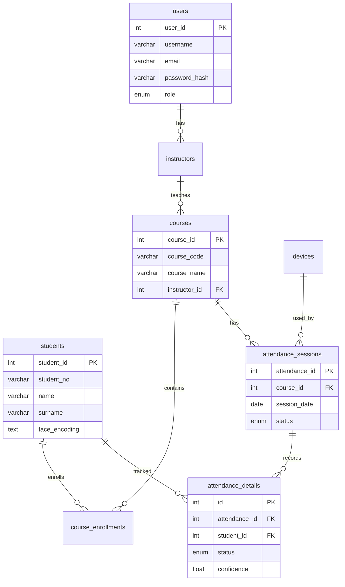

# 🎓 Akıllı Yoklama Takip Sistemi

**Yüz tanıma teknolojisi ile otomatik yoklama alan, modern ve akıllı bir öğrenci devam takip sistemi.**

[](https://reactjs.org/)
[](https://www.typescriptlang.org/)
[](https://vitejs.dev/)
[](https://www.php.net/)
[](https://mariadb.org/)
[](https://www.electronjs.org/)
[](https://tailwindcss.com/)

---

[Özellikler](#-özellikler) •
[Mimari](#-mimari) •
[Kurulum](#%EF%B8%8F-kurulum) •
[Kullanım](#-kullanım) •
[API Referansı](#-api-referansı) •
[Veritabanı](#-veritabanı)

</div>

---

## 📋 Proje Hakkında

**Akıllı Yoklama Takip Sistemi**, eğitim kurumlarında yoklama sürecini dijitalleştiren ve otomatikleştiren full-stack bir web uygulamasıdır. Tarayıcı tabanlı **yüz tanıma** teknolojisi sayesinde öğrencilerin yoklaması kameradan otomatik olarak alınabilir. Sistem; **admin**, **öğretmen** ve **öğrenci** olmak üzere üç farklı kullanıcı rolünü destekler ve her role özel kontrol paneli sunar.

### ✨ Özellikler

| Özellik | Açıklama |
|---|---|
| 🤖 **Yüz Tanıma ile Yoklama** | TensorFlow.js ve face-api.js kullanarak tarayıcıda gerçek zamanlı yüz algılama ve tanıma |
| 👥 **Rol Tabanlı Erişim** | Admin, Öğretmen ve Öğrenci rolleri ile farklı yetki seviyeleri |
| 📊 **İnteraktif Dashboard** | Her role özel istatistikler ve grafikler sunan kontrol panelleri |
| 📚 **Ders Yönetimi** | Ders oluşturma, öğrenci kaydı, öğretmen ataması |
| 📸 **Fotoğraflı Öğrenci Kaydı** | Öğrenci fotoğrafları yükleme ve yüz encoding oluşturma |
| 📱 **Cihaz Yönetimi** | Kamera/cihaz durumu izleme ve yönetimi |
| 🌙 **Karanlık / Aydınlık Tema** | Kullanıcı tercihine göre tema değiştirme |
| 🖥️ **Masaüstü Uygulama** | Electron ile masaüstü uygulama olarak çalıştırma desteği |
| 🔐 **Güvenli Kimlik Doğrulama** | Şifre hashleme, oturum yönetimi ve şifremi unuttum akışı |

---

## 🏗 Mimari

Proje **istemci-sunucu** mimarisi üzerine kurulmuştur:

```
┌──────────────────────────────────────────────────────────────┐
│                        İstemci (Client)                      │
│  ┌────────────────────────────────────────────────────────┐  │
│  │   React 18 + TypeScript + Vite + TailwindCSS           │  │
│  │   ┌──────────┐  ┌──────────┐  ┌───────────────────┐   │  │
│  │   │ Dashboard │  │ Yoklama  │  │  Yüz Tanıma       │   │  │
│  │   │ Panelleri │  │ Yönetimi │  │  (face-api.js)    │   │  │
│  │   └──────────┘  └──────────┘  └───────────────────┘   │  │
│  └────────────────────────────────────────────────────────┘  │
│                          │  REST API                         │
│  ┌────────────────────────────────────────────────────────┐  │
│  │              Sunucu (PHP REST API)                     │  │
│  │   ┌──────────┐  ┌──────────┐  ┌──────────┐           │  │
│  │   │ Auth     │  │ CRUD     │  │ Dosya    │           │  │
│  │   │ Endpoints│  │ İşlemleri│  │ Yükleme  │           │  │
│  │   └──────────┘  └──────────┘  └──────────┘           │  │
│  └────────────────────────────────────────────────────────┘  │
│                          │  PDO                              │
│  ┌────────────────────────────────────────────────────────┐  │
│  │           MariaDB / MySQL Veritabanı                   │  │
│  │   users • students • courses • attendance_sessions     │  │
│  │   course_enrollments • devices • attendance_details    │  │
│  └────────────────────────────────────────────────────────┘  │
└──────────────────────────────────────────────────────────────┘
```

---

## 🛠️ Teknoloji Yığını

### Frontend
| Teknoloji | Sürüm | Kullanım Alanı |
|---|---|---|
| React | 18.2 | UI bileşen kütüphanesi |
| TypeScript | 5.3 | Tip güvenliği |
| Vite | 5.0 | Build aracı ve geliştirme sunucusu |
| TailwindCSS | 3.3 | Utility-first CSS framework |
| React Router | 6.22 | İstemci taraflı yönlendirme |
| Lucide React | 0.298 | İkon kütüphanesi |
| face-api.js | 1.7 | Tarayıcıda yüz tanıma |
| TensorFlow.js | 4.15 | ML backend (WebGL / CPU) |

### Backend
| Teknoloji | Kullanım Alanı |
|---|---|
| PHP 8+ | REST API sunucusu |
| PDO | Veritabanı erişim katmanı |
| MariaDB / MySQL | İlişkisel veritabanı |

### Masaüstü
| Teknoloji | Sürüm | Kullanım Alanı |
|---|---|---|
| Electron | 27 | Cross-platform masaüstü uygulama |

---

## ⚙️ Kurulum

### Ön Gereksinimler

- **Node.js** 18 veya üzeri
- **XAMPP** (MariaDB + PHP 8) veya eşdeğer bir PHP / MySQL ortamı
- **Git**

### 1. Depoyu Klonlayın

```bash
git clone https://github.com/<kullanici-adi>/akilli-yoklama-takibi.git
cd akilli-yoklama-takibi
```

### 2. Veritabanını Hazırlayın

1. XAMPP üzerinden **MariaDB** servisini başlatın.
2. **phpMyAdmin** veya komut satırı ile `smart_attendance` veritabanını oluşturun:

```sql
-- Şema dosyasını içe aktarın
SOURCE db/smart_attendance.sql;
```

3. Migrasyon dosyalarını sırasıyla uygulayın:

```sql
SOURCE db/migrations/001_add_face_encoding_and_reset.sql;
SOURCE db/migrations/002_add_device_fields.sql;
```

4. *(İsteğe bağlı)* Demo verileri yükleyin:

```sql
SOURCE db/seed.sql;
```

### 3. API Sunucusunu Başlatın

```bash
php -S localhost:8079 -t .
```

> **Not:** Veritabanı bağlantı bilgileriniz farklıysa `smart_attendance_api/config.php` dosyasını düzenleyin.

### 4. Frontend'i Başlatın

```bash
npm install
npm run dev
```

Uygulama varsayılan olarak **http://localhost:5173** adresinde çalışacaktır.

### 5. *(İsteğe bağlı)* Masaüstü Uygulaması

Electron ile masaüstü uygulaması olarak çalıştırmak için:

```bash
npm run dev:desktop
```

### 6. Yüz Tanıma Modelleri

Yüz tanıma özelliğinin çalışabilmesi için gerekli model dosyalarını `public/models/` dizinine indirin. Gereken modeller:

| Model | Açıklama |
|---|---|
| `tiny_face_detector` | Hızlı yüz algılama modeli |
| `face_landmark_68` | 68 noktalı yüz landmark tespiti |
| `face_recognition` | Yüz tanıma / eşleştirme modeli |

> Detaylı bilgi için `public/models/README.txt` dosyasına bakın.

### Ortam Değişkenleri

Kök dizindeki `.env` dosyası API adresini içerir:

```env
VITE_API_BASE=http://localhost:8079/smart_attendance_api
```

---

## 🚀 Kullanım

### Roller ve Yetkiler

<table>
<tr>
<th>Sayfa / Özellik</th>
<th>🔴 Admin</th>
<th>🟡 Öğretmen</th>
<th>🟢 Öğrenci</th>
</tr>
<tr><td>Dashboard</td><td>✅ Genel İstatistikler</td><td>✅ Ders İstatistikleri</td><td>✅ Kişisel Yoklama</td></tr>
<tr><td>Öğrenci Yönetimi</td><td>✅</td><td>❌</td><td>❌</td></tr>
<tr><td>Öğretmen Yönetimi</td><td>✅</td><td>❌</td><td>❌</td></tr>
<tr><td>Ders Yönetimi</td><td>✅</td><td>✅</td><td>❌</td></tr>
<tr><td>Yoklama Oturumları</td><td>✅</td><td>✅</td><td>❌</td></tr>
<tr><td>Cihaz Yönetimi</td><td>✅</td><td>❌</td><td>❌</td></tr>
</table>

### Varsayılan Şifre

Admin tarafından oluşturulan öğrenci ve öğretmen hesapları varsayılan olarak `123456` şifresiyle oluşturulur.

---

## 📡 API Referansı

API, `http://localhost:8079/smart_attendance_api` adresinde çalışır ve aşağıdaki endpoint'leri sunar:

### Kimlik Doğrulama

| Metot | Endpoint | Açıklama |
|---|---|---|
| `POST` | `/login.php` | Kullanıcı girişi |
| `POST` | `/register.php` | Yeni kullanıcı kaydı |
| `POST` | `/forgot_password.php` | Şifre sıfırlama |

### Öğrenci İşlemleri

| Metot | Endpoint | Açıklama |
|---|---|---|
| `GET` | `/students.php` | Öğrenci listesi |
| `POST` | `/create_student.php` | Yeni öğrenci oluştur |
| `POST` | `/update_student.php` | Öğrenci bilgilerini güncelle |

### Ders İşlemleri

| Metot | Endpoint | Açıklama |
|---|---|---|
| `GET` | `/courses.php` | Ders listesi |
| `POST` | `/create_course.php` | Yeni ders oluştur |
| `POST` | `/assign_student_courses.php` | Öğrenci-ders kaydı |
| `POST` | `/remove_student_course.php` | Öğrenciyi dersten çıkar |
| `POST` | `/assign_teacher_course.php` | Öğretmeni derse ata |
| `POST` | `/remove_teacher_course.php` | Öğretmeni dersten çıkar |
| `GET` | `/course_students.php` | Derse kayıtlı öğrenciler |

### Yoklama İşlemleri

| Metot | Endpoint | Açıklama |
|---|---|---|
| `GET` | `/attendance.php` | Yoklama oturumları listesi |
| `POST` | `/create_attendance_session.php` | Yeni yoklama oturumu başlat |
| `POST` | `/end_attendance_session.php` | Yoklama oturumunu sonlandır |
| `POST` | `/record_attendance.php` | Yoklama kaydı ekle |
| `POST` | `/log_scan.php` | Tarama kaydı |

### Diğer

| Metot | Endpoint | Açıklama |
|---|---|---|
| `GET` | `/teachers.php` | Öğretmen listesi |
| `POST` | `/create_teacher.php` | Yeni öğretmen oluştur |
| `GET` | `/devices.php` | Cihaz listesi |
| `GET` | `/stats.php` | Genel istatistikler |

---

## 🗄 Veritabanı

Sistem 7 tablo içeren ilişkisel bir veritabanı yapısı kullanır:



> 📌 ER diyagramının görsel versiyonu için: [`docs/er_diagram.png`](docs/er_diagram.png)

---

## 📁 Proje Yapısı

```
akilli-yoklama-takibi/
├── 📂 db/                          # Veritabanı dosyaları
│   ├── smart_attendance.sql        # Ana şema
│   ├── smart_attendance_schema.sql # Temiz şema (referans)
│   ├── seed.sql                    # Demo veri
│   ├── sample_data.sql             # Örnek veri
│   └── 📂 migrations/             # Migrasyon dosyaları
│       ├── 001_add_face_encoding_and_reset.sql
│       └── 002_add_device_fields.sql
│
├── 📂 docs/                        # Belgeler
│   └── er_diagram.png              # ER diyagramı
│
├── 📂 public/
│   └── 📂 models/                  # Yüz tanıma ML modelleri
│
├── 📂 smart_attendance_api/        # PHP REST API
│   ├── config.php                  # Veritabanı ve CORS ayarları
│   ├── db.php                      # PDO bağlantısı
│   ├── bootstrap.php               # Ortak yüklemeler
│   ├── helpers.php                 # Yardımcı fonksiyonlar
│   ├── response.php                # JSON yanıt yardımcısı
│   ├── 📂 uploads/                 # Yüklenen dosyalar
│   └── *.php                       # API endpoint'leri
│
├── 📂 src/                         # React frontend kaynak kodu
│   ├── App.tsx                     # Rota tanımları
│   ├── main.tsx                    # Uygulama giriş noktası
│   ├── index.css                   # Global stiller
│   ├── Login.tsx                   # Giriş sayfası
│   ├── Register.tsx                # Kayıt sayfası
│   ├── ForgotPassword.tsx          # Şifremi unuttum
│   ├── Dashboard.tsx               # Admin paneli
│   ├── TeacherDashboard.tsx        # Öğretmen paneli
│   ├── StudentDashboard.tsx        # Öğrenci paneli
│   ├── Students.tsx                # Öğrenci yönetimi
│   ├── Teachers.tsx                # Öğretmen yönetimi
│   ├── Courses.tsx                 # Ders yönetimi
│   ├── Attendance.tsx              # Yoklama yönetimi
│   ├── Devices.tsx                 # Cihaz yönetimi
│   ├── 📂 components/             # Tekrar kullanılabilir bileşenler
│   │   ├── Sidebar.tsx             # Yan menü
│   │   ├── TopBar.tsx              # Üst çubuk
│   │   ├── ThemeToggle.tsx         # Tema değiştirici
│   │   ├── RoleRoute.tsx           # Yetkili rota koruması
│   │   └── 📂 ui/                 # Temel UI bileşenleri
│   │       ├── badge.tsx
│   │       ├── button.tsx
│   │       ├── card.tsx
│   │       ├── input.tsx
│   │       ├── label.tsx
│   │       ├── select.tsx
│   │       └── table.tsx
│   ├── 📂 contexts/               # React Context'ler
│   │   └── AuthContext.tsx         # Kimlik doğrulama durumu
│   └── 📂 lib/                    # Yardımcı modüller
│       ├── faceApi.ts              # face-api.js yapılandırması
│       ├── avatar.ts               # Avatar oluşturucu
│       └── utils.ts                # Genel yardımcılar
│
├── electron-main.cjs               # Electron ana işlem
├── package.json
├── vite.config.ts
├── tailwind.config.cjs
├── tsconfig.json
└── .env                            # Ortam değişkenleri
```

---

## 🤝 Katkıda Bulunma

1. Bu depoyu **fork** edin
2. Yeni bir branch oluşturun (`git checkout -b feature/yeni-ozellik`)
3. Değişikliklerinizi commit edin (`git commit -m 'feat: yeni özellik eklendi'`)
4. Branch'inizi push edin (`git push origin feature/yeni-ozellik`)
5. Bir **Pull Request** açın

---

## 📄 Lisans

Bu proje eğitim amaçlı geliştirilmiştir.

---

<div align="center">

**⭐ Bu projeyi beğendiyseniz yıldız vermeyi unutmayın!**
